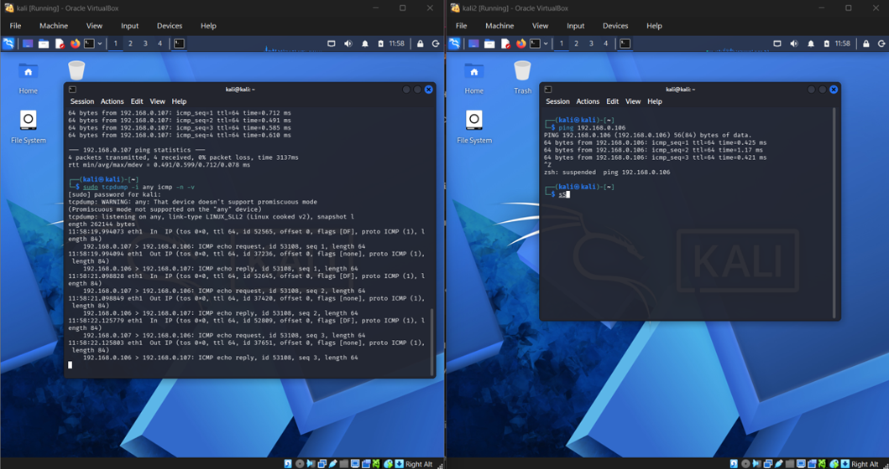
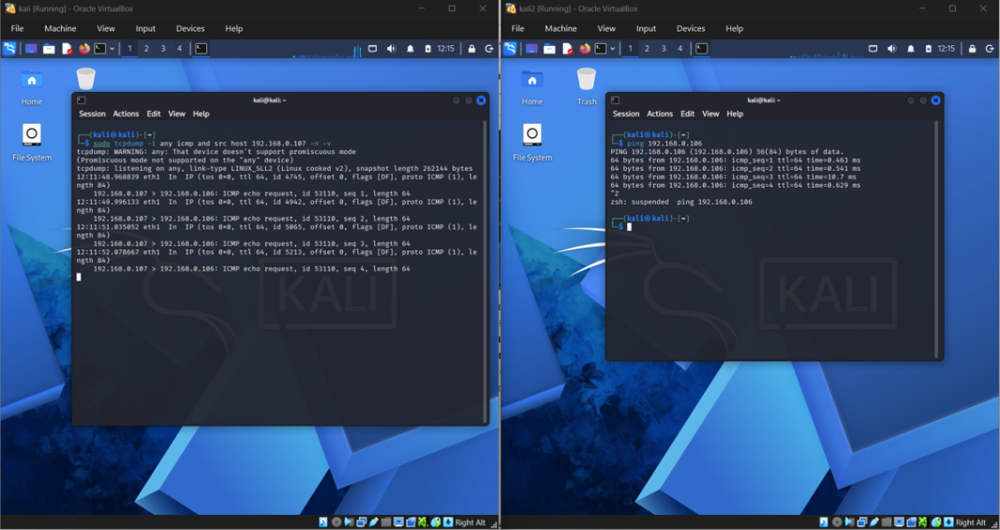
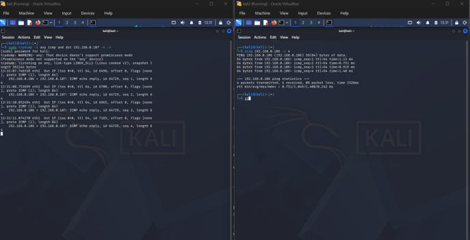
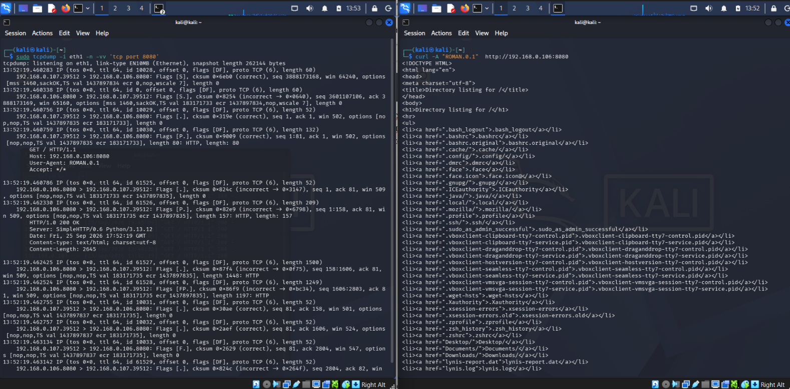
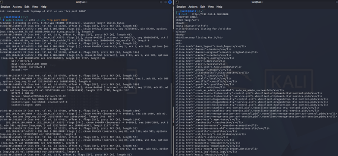
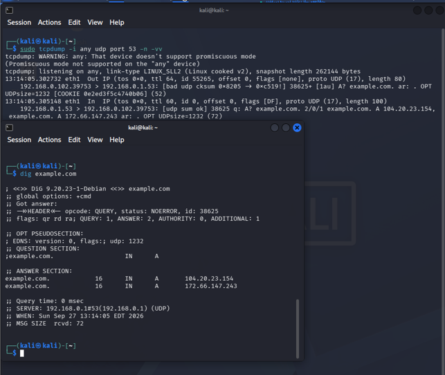
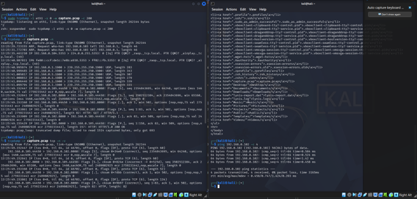
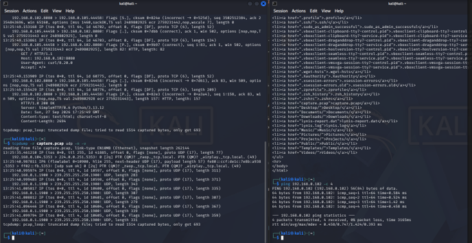
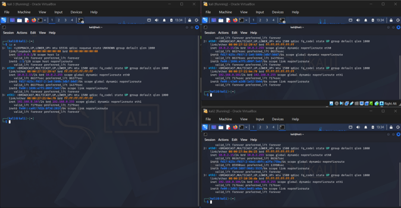
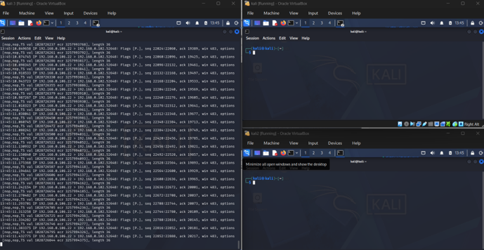

ЗАВДЯННЯ 1
Так, за допомогою команди tcpdump захопив пакети даних ІСМР трафіку між вдома віртальними машинами. Після використання команди ping на екрані першої машини з’явилась інформацію про запит і відповідь (request/reply) про отримання пакетів даних, де зазначається: адреса відправника; адреса отримувача; час життя пакетів (TTL); протокол, який використовувався (ICMP); номер ідентифікатору пінгів (ID); порядкові номери запитів, усього 3 (sequence).

ЗАВДЯННЯ 2
Так, за допомогою команди tcpdump захопив пакети даних ІСМР вхідного та вихідного трафіку між вдома віртальними машинами. src host – фільтрує трафіки, де вказана мною адреса є відправником і dst host – фільтрує трафіки, де вказана мною адреса є отримувачем.

ЗАВДЯННЯ 3
Так, за допомогою команди tcpdump захопив пакети даних трафіку http сервера трафіку між вдома віртальними машинами. На ВМ2 в рядку User-agent висвітлюються дані вказані мною на ВМ1.

ЗАВДЯННЯ 4
Так, за допомогою команди tcpdump захопив пакети даних трафіку запущеного http сервера трафіку між вдома віртальними машинами. Можна побачити як 192.168.0.107 розпочинає процес threeway handshake з 192.168.0.106 в рядку за зазначається запит на синхронізацію [S], далі 192.168.0.106 підтверджує запит і надсилає свій [S.], 192.168.0.107 підтверджує [.] і підтверджує, що отримав дані [P.], завершується це все закриття з’єднання [F.].

ЗАВДЯННЯ 5
Так, за допомогою команди tcpdump захопив пакети даних трафіку dns-запиту на віртуальній машині. За допомогою команди dig здійснив запит example.com, де відобразились всі необхідні дані: ID запиту та відповіді (38265); тип запиту (А); TTL (72).

ЗАВДЯННЯ 6
Так, за допомогою команди tcpdump захопив пакети даних трафіку і зберіг у файлі форматі .pcap http сервера між двома віртуальними машинами. Після цього за допомогою опції -r прочитав лише TCP трафік і UDP трафік

ЗАВДЯННЯ 7
За допомогою команди ір а дізнався адреси трьох віртуальних машин, після цього за допомогою tcpdump на ВМ 1 перехопив трафіки ВМ 2 і ВМ 3.

